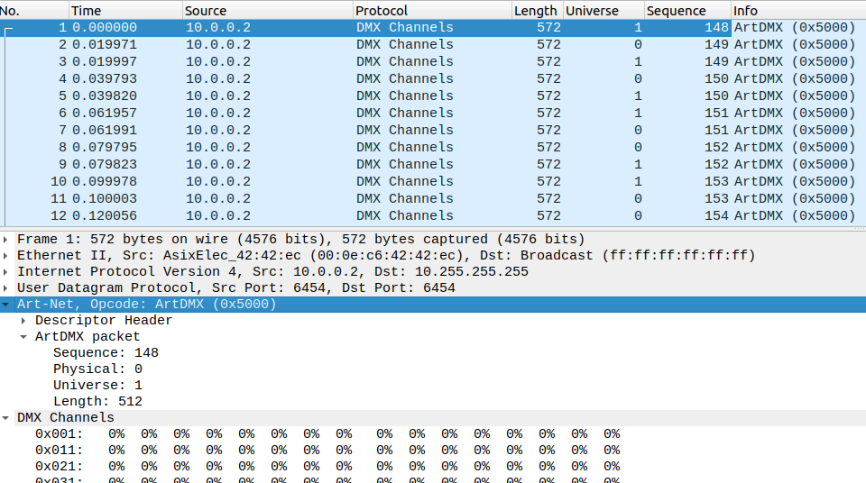
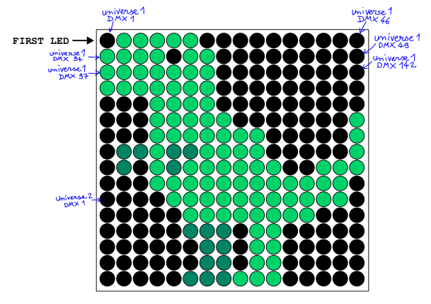
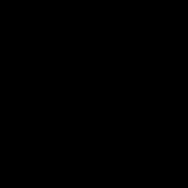

# Illuminated

## Challenge
Une éclairagiste vous met au défi de reconstituer une animation d'un écran vidéo stockée sur son enregistreur DMX. Vous réalisez alors une capture réseau (capture.pcap) en vous branchant en Ethernet sur son enregistreur.

Pour vous aider, elle vous donne un extrait annoté de la documentation de son écran vidéo (cheatsheet.pdf).

Releverez-vous le défi ?

## Inputs
- PCAP file: [./capture.pcap](./capture.pcap)
- Cheat sheet: [cheatsheet.pdf](./cheatsheet.pdf)

## Analyse the PCAP capture
The `PCAP file` captures the `DMX data` transported over protocol `Art-Net` on `UDP`:



Each packet contains:
- a `sequence number`, to associate `DMX data` from different `universes`
- a `universe id` (a `universe` is a set of 512 `DMX channels`)
- data for the 512 `DMX channels` for that `universe`

## Grab data from PCAP capture
Using `tshark`, we can extract all the packets in `json` format:

```console
$ tshark -r capture.pcap -T json > packets.json
```

Here's a packet structure, with the layers we're interested in: the `artnet` and the  `dmx_chan` layers:

```console
$ head -n 150 packets.json
[
  {
    "_index": "packets-2024-01-01",
    "_type": "doc",
    "_score": null,
    "_source": {
      "layers": {
(...)
         "artnet": {
          "artnet.header": {
            "artnet.header.id": "Art-Net",
            "artnet.header.opcode": "0x5000",
            "artnet.header.protver": "14"
          },
          "artnet.output": {
            "artnet.output.sequence": "148",
            "artnet.output.physical": "0",
            "artnet.output.universe": "1",
            "artnet.output.length": "512"
          }
        },
        "dmx_chan": {
         "dmx_chan.data_filter": "00:00:00:00:00:00:00:00:00:00:00:00:00:00:00:00:00:00:00:00:(...)
```

The `json` format makes it easy to extract the fields we want using `jq`, namely the `arnet universe` (set of 512 DMX channels) and the `DMX data`:
```console
$ cat packets.json | jq '.[] | ._source.layers as $l | [$l.artnet."artnet.output"."artnet.output.universe", $l.dmx_chan."dmx_chan.data_filter"] | join(",")' > artnet.txt
```

## Load DMX data in python
Now we need to parse file `artnet.txt` and extract the `DMX data` in python, before crafting the images. We parse the value of the `universe` (0 or 1), and the `dmx_data`. We make some consistency checks:
- make sure we endup with `universe` value 0 or 1, as in the `PCAP` file
- make sure we endup with `dmx_data` length 512, corresponding to the maximum size of `DMX channels` in a `universe`.
We store the `dmx_data` in two lists `universe0` and `universe1` and also make sure they have the same size.

```python
CHANNEL_MAX = 512

universe0 = list()
universe1 = list()

def parse_file(filename):
    with open(filename, 'r') as f:
        for line in f:
            # Grab universe and DMX data
            [universe, dmx_data] = line.replace("\"", "").split(",")
            dmx_data = dmx_data.split(":")
            # Make sure we have universe 0 or 1
            # Also make sure we have data for the 512 DMX channels
            assert (universe == "0" or universe == "1")
            assert (len(dmx_data) == CHANNEL_MAX)
            # Update the corresponding sequence
            # ! Since there are two universes, a sequence is made of two chunks
            if universe == "0":
                universe0.append(dmx_data)
            else:
                universe1.append(dmx_data)

parse_file('artnet.txt')
# Make sure we have same amount of data for both universes
assert len(universe0) == len(universe1)
```

## Build images from DMX data
The `Cheat sheet` file specifies how the `DMX channels` are mapped into the image:



Outcome:
- The image is made of (16x16) LEDs
- `DMX channels` from 1st `universe` are mapped on the 10 first lines (so 10*16 `DMX channels`)
- `DMX channels` from 2nd `universe` are mapped on the next lines  (so 8*16 `DMX channels`)
- On even lines, the `DMX channels` are mapped from left to right
- On odd lines, the `DMX channels` are mapped from right to left

When building the images, we'll draw blocks (rectangles) of 20x20, representing one LED.

We build the image in three steps:
- Creation of an empty image of size (16x20,16x20)
- Draw the rectangles associated to 1st set of `DMX channels` (1st `universe`), starting at 1st line
- Draw the rectangles associated to 2nd set of `DMX channels` (2nd `universe`), starting at 11th line

The images are appends to a list that will be used to create the `GIF file`.

``` python
SIZE = 16
BLOCK_SIZE = 20

DMX0_CHANNEL_NB = 10*SIZE
DMX1_CHANNEL_NB =  8*SIZE

images = list()

def draw_image(img, dmx, row_start, nb_channel):
    # Loop on DMX Channel
    for i in range(0, nb_channel*3, 3):
        # DMX channel
        ch = i // 3
        # Grab RGB colors
        rgb = (int(dmx[i], 16), int(dmx[i+1], 16), int(dmx[i+2], 16))
        # Draw the corresponding block in the image with the specified color
        row = row_start + ch // SIZE
        col = ch % SIZE
        if row % 2 != 0:
            # Odd row: right to left
            col = SIZE - col - 1
        rect = (col*BLOCK_SIZE, row*BLOCK_SIZE, (col+1)*BLOCK_SIZE, (row+1)*BLOCK_SIZE)
        draw = ImageDraw.Draw(img)
        draw.rectangle(rect, fill=rgb, outline=None)

def build_image(dmx0, dmx1):
    # Creates a new empty image
    img = Image.new('RGB', (SIZE*BLOCK_SIZE, SIZE*BLOCK_SIZE), (255, 255, 255))
    draw_image(img, dmx0, 0,  DMX0_CHANNEL_NB)
    draw_image(img, dmx1, 10, DMX1_CHANNEL_NB)
    return img

def build_images(n):
    for i in range(n):
        dmx0, dmx1 = universe0[i], universe1[i]
        img = build_image(dmx0, dmx1)
        images.append(img)

n = len(universe0)
build_images(n)
```

## Build the GIF file
Finally, we create the `GIF file` from the set of images stores in list `images`:
```python
def build_gif(filename):
    images[0].save(filename,
                   save_all=True,
                   append_images=images[1:],
                   optimize=False,
                   duration=40, loop=0)

build_gif('artnet.gif')
```
Here's the output and the flag !



## Python code
Complete python code at [sol.py](./sol.py)

## Flag
> FCSC{L1ghtD3sign3rCr-gg!}
