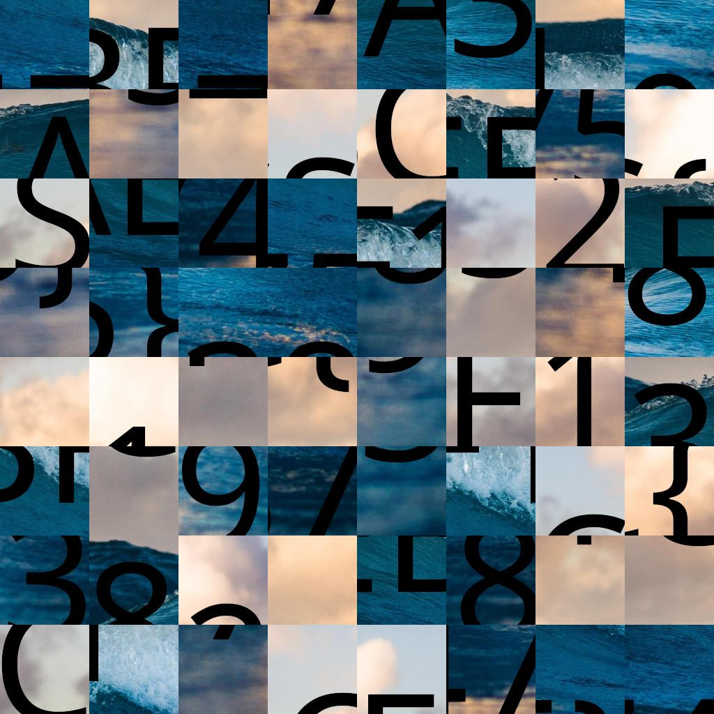
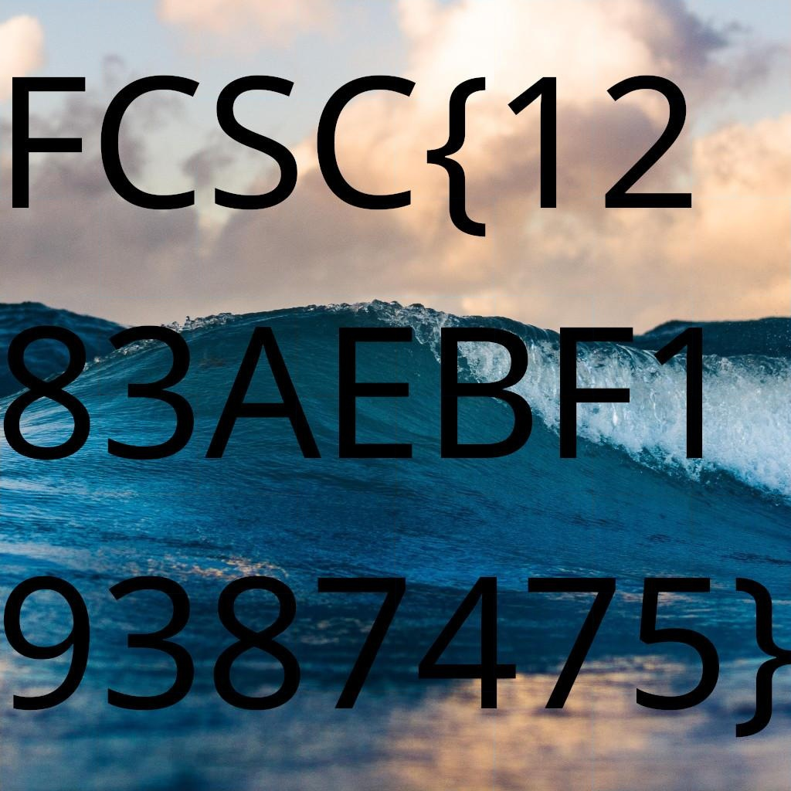

# Puzzle Trouble 1/2

## Challenge
On vous demande de retrouver le flag dans ce bazar de tuiles ! Il paraît qu'elles n'ont pas été retournées...

## Inputs
- 

## Solution
I ended up using this python puzzle solver at https://github.com/nemanja-m/gaps.git.

We need to input the block size. Image is (1024x1024 pix) and (8x8 blocks), hence a block size of 128.

```console
$ python3 cli.py  run puzzle-trouble-easy.jpg sol-easy.jpg --size=128
Population: 200
Generations: 20
Piece size: 128
=== Pieces:      64

=== Analyzing image: ██████████████████████████████████████████████████ 100.0%
=== Solving puzzle:  ████████████████████████████████------------------ 63.2%

=== GA terminated
=== There was no improvement for 10 generations
Puzzle solved
```

This gives me the `unpuzzled` image:



## Flag
> FCSC{1283AEBF19387475}
