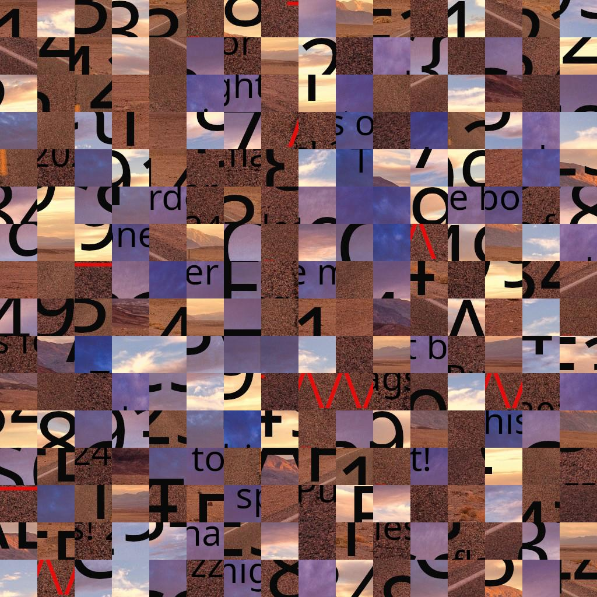

# Puzzle Trouble 2/2

## Challenge
On vous demande de retrouver le flag dans ce bazar de tuiles ! Il paraît qu'elles n'ont pas été retournées...

## Inputs
- 

## Solution
Same as previous one, using same solver at https://github.com/nemanja-m/gaps.git.

We need to input the block size. Image is (1024x1024 pix) and (16x16 blocks), hence a block size of 64.

```console
$ python3 cli.py  run puzzle-trouble-hard.jpg sol-hard.jpg --size=64
Population: 200
Generations: 20
Piece size: 64
=== Pieces:      256

=== Analyzing image: ██████████████████████████████████████████████████ 100.0%
=== Solving puzzle:  ██████████████████████████████████████████-------- 84.2%

=== GA terminated
=== There was no improvement for 10 generations
Puzzle solved
```

This outputs an incomplete solution:


So I re-iterated the process multiple times as follow, to get better solution each time:
```console
$ python3 cli.py  run sol-hard.jpg sol2-hard.jpg --size=64
(...)
$ python3 cli.py  run sol2-hard.jpg sol3-hard.jpg --size=64
(...)
$ python3 cli.py  run sol3-hard.jpg sol4-hard.jpg --size=64
(...)
```

Finally, I got a pretty clean solution:


## Flag
> FCSC{93784AE384999121FE3123441984}
