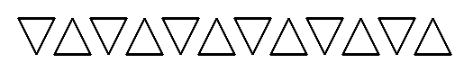

# Tortuga

## Challenge
On vous propose une séance de dessin !

Le fichier tortuga-flag.txt contient le flag dessiné uniquement à l'aide de segments.

La méthode pour encoder ces segments est simpliste. On fixe un point de départ P(x, y) initialisé à un point quelconque dans le plan, par exemple (0, 0). Puis, chaque élément (dx, dy) dans la liste L fournie dans le fichier tortuga.txt permet d'atteindre un nouveau point Q(x + dx, y + dy) et le segment PQ est tracé entre ces deux points. Une fois ce segment tracé, le point courant P est remplacé par le point Q, et ce procédé est itéré sur tous les éléments de la liste.

Afin d'autoriser plusieurs symboles, la valeur spéciale (0, 0) pour (dx, dy) est utilisée pour déplacer le point P comme décrit ci-dessus avec l'élément suivant de la liste, mais aucun segment n'est tracé.

On donne l'exemple suivant (tortuga-example.txt) où le point initial P est choisi tout en haut à gauche.

```
[
	# Draw triangle pointing down (drawn clockwise)
	(2, 0), (-1, 2), (-1, -2),
	# Skip
	(0, 0), (3, 0),
	# Draw triangle pointing up (drawn counterclockwise)
	(-1, 2), (2, 0), (-1, -2),
	# Skip
	(0, 0), (1, 0),
] * 6
```

Et l'image associée :



> Note : le flag est de la forme FCSC{[0-9]+}.

## Inputs
- [tortuga-flag.txt](./tortuga-flag.txt)

## Solution
We use library `PIL` to create an empty image and draw lines in it. Nothing special, except the handling of the `skip` to avoid drawing between letters.

The size of the original image has been adjusted after try-error. Finally, the size of the unit grid has been choosen so that we can easily read the drawn letters: `unit = 20`.

```python
import sys
from PIL import Image, ImageDraw

flag = [(0,2),(0,-2),(1,0),(-1,0),(0,1),(1,0),(0,0),(1,1),(0,-2),(1,0),(-1,0),(0,2),(1,0),(0,0),(2,-2),(-1,0),(0,1),(1,0),(0,1),(-1,0),(0,0),(2,0),(0,-2),(1,0),(-1,0),(0,2),(1,0),(0,0),(3,-2),(-1,0),(0,1),(-1,0),(1,0),(0,1),(1,0),(0,0),(4,-2),(-2,0),(0,0),(0,2),(2,0),(0,-2),(0,1),(-2,0),(0,0),(3,-1),(0,2),(0,0),(3,-2),(-1,0),(-1,1),(0,1),(2,0),(0,-1),(-2,0),(0,0),(3,0),(1,0),(0,-1),(-1,0),(0,2),(1,0),(0,-1),(0,0),(1,1),(1,0),(0,-2),(-1,0),(0,0),(0,1),(1,0),(0,0),(2,1),(0,-2),(-1,1),(2,0),(0,0),(1,-1),(1,0),(-1,2),(0,0),(0,-1),(1,0),(0,0),(1,-1),(1,0),(0,1),(-1,0),(0,1),(1,0),(0,0),(1,0),(1,0),(0,-1),(-1,0),(0,-1),(1,0),(0,0),(1,2),(0,-2),(1,0),(-1,0),(0,2),(1,0),(0,-1),(-1,0),(0,0),(2,1),(1,0),(-1,0),(0,-2),(1,0),(-1,2),(1,0),(0,-2),(0,0),(1,0),(0,1),(1,0),(0,-1),(0,2),(0,0),(2,-2),(1,0),(0,1),(1,0),(-1,0),(0,1),(-1,0)]

unit = 20

# creates a new empty image
img = Image.new('RGB', (50*unit, 4*unit), (255, 255, 255))
draw = ImageDraw.Draw(img)

# Initial point
P = (unit,unit)

# Loop over position deltas
skip = False
for pos in flag:
    if pos == (0,0):
        skip = True
        continue
    dx, dy = pos[0] * unit, pos[1] * unit
    Q = (P[0] + dx, P[1] + dy)
    if skip == False:
        draw.line((P[0], P[1], Q[0], Q[1]), fill=0, width=3)
    else:
        skip = False
    P = Q

img.save('sol.png')
```

We get the flag drawn in the generated image:


## Python code
See [sol.py](./sol.py)

## Flag
> FCSC{316834725604}
