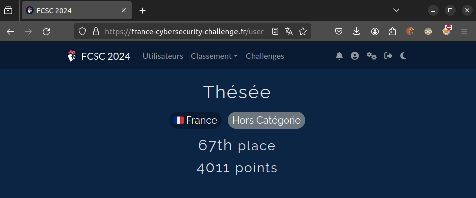

# FCSC-2024

Some writeups for the FCSC 2024 CTF competition at https://france-cybersecurity-challenge.fr/

- Crypto / [AdveRSArial Crypto (Baby)](/Crypto/adversarial_crypto_baby/README.md)
- Crypto / [El Gamal Fait (1/2)](/Crypto/el_gamal_fait_part1/README.md)
- Forensics / [Silence](/Forensics/silence/README.md)
- Forensics / [Horreur, malheur 1/5 - Archive chiffrée](/Forensics/horreur_malheur_part1/README.md)
- Forensics / [Horreur, malheur 2/5 - Accès initial](/Forensics/horreur_malheur_part2/README.md)
- Forensics / [Horreur, malheur 3/5 - Simple persistane](/Forensics/horreur_malheur_part3/README.md)
- Forensics / [Horreur, malheur 4/5 - Pas si simple persistance](/Forensics/horreur_malheur_part4/README.md)
- Forensics / [SOC Simulator](/Forensics/soc_simulator_part4/README.md)
- Misc / [Tortuga](/Misc/tortuga/README.md)
- Misc / [Illuminated](/Misc/illuminated/README.md)
- Misc / [Prison break 1/2](/Misc/prison_break_part1/README.md)
- Misc / [Prison break 2/2](/Misc/prison_break_part2/README.md)
- Misc / [Puzzle Trouble 1/2](/Misc/puzzle_trouble_part1/README.md)
- Misc / [Puzzle Trouble 2/2](/Misc/puzzle_trouble_part2/README.md)
- Reverse / [Fifty Shades of White (Pinkman)](/Reverse/fifty_shades_of_white/README.md)

